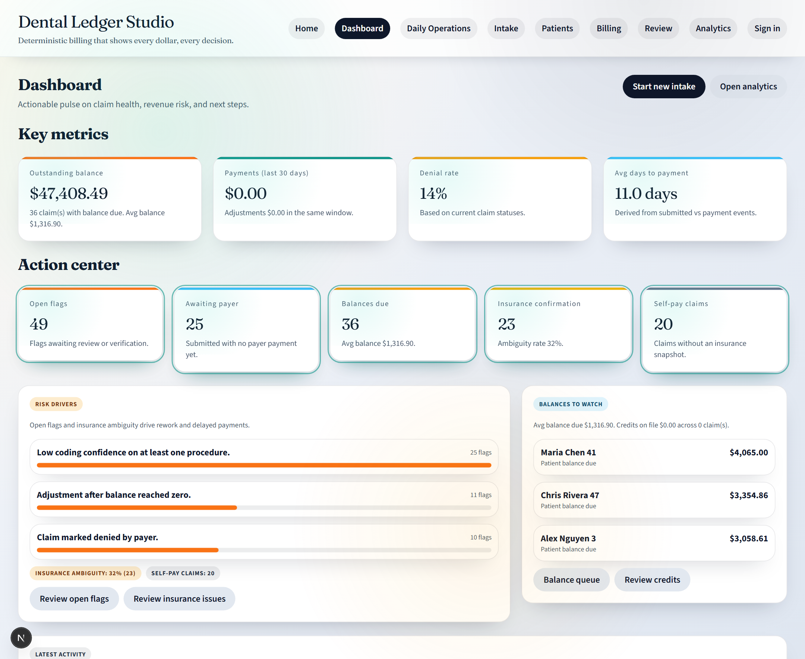
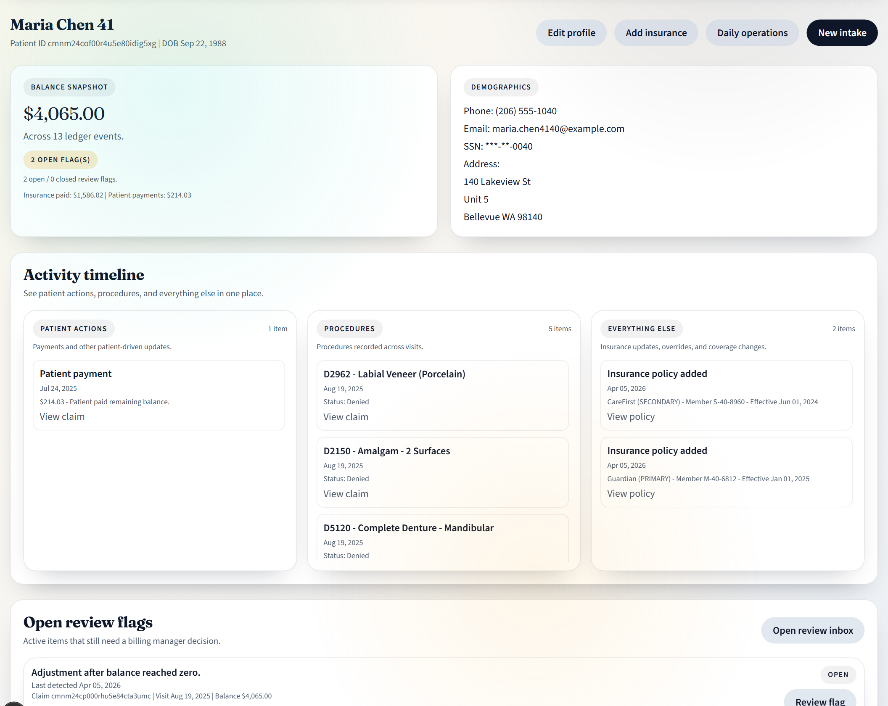
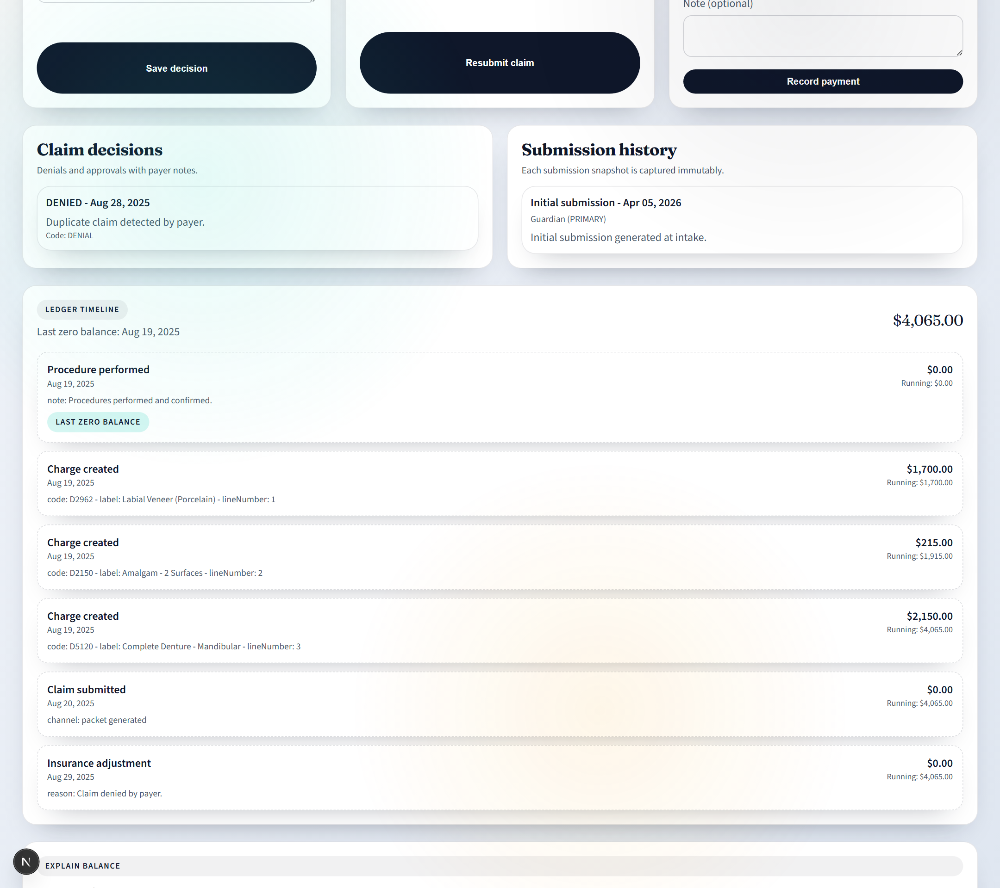
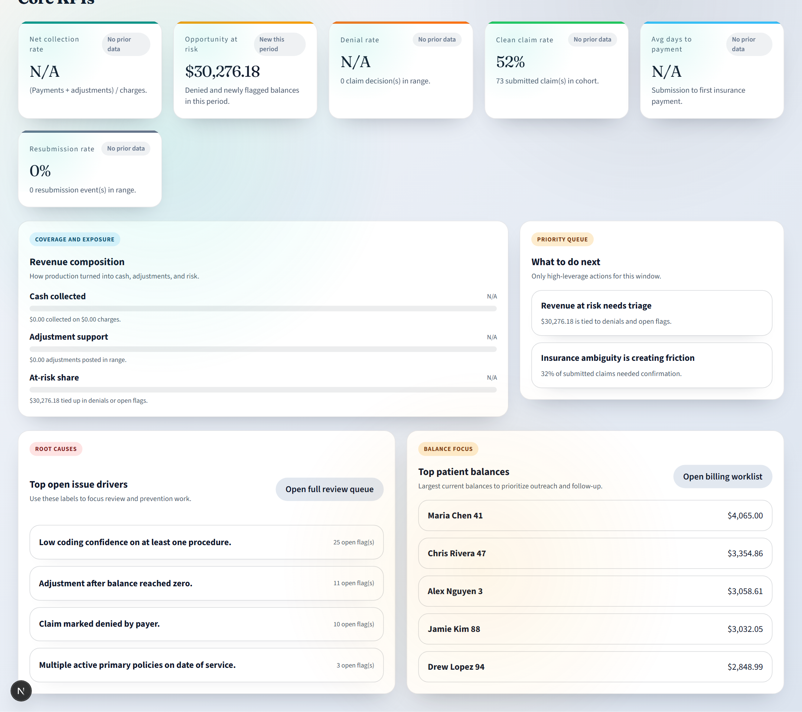

# Dental Ledger Studio

Ledger-first dental billing and claims review that makes every balance, insurance decision, and review flag explainable.



## Why This Matters In 30 Seconds

- Explainable balances: account state is derived from ledger events instead of hidden balance mutation.
- Date-of-service insurance logic: claims preserve the insurance context used at submission time.
- Actionable review flow: flags, denials, and analytics point the user to the next decision.

## 60-Second Demo Path

1. Sign in and start on the dashboard.
2. Open `Maria Chen 41` from the balance watch list.
3. On the patient profile, show the balance snapshot, activity timeline, and open review flags.
4. Open the denied claim timeline from the patient workflow.
5. Show preserved submission context, the ledger-backed balance, and the review actions.
6. Jump to analytics to show the priority queue and risk signals.

## Workflow At A Glance

<p align="center">
  
  
  
</p>

## What The Product Does

Dental Ledger Studio is a focused dental billing workflow demo built around deterministic business logic. It covers:

- appointments and daily operations
- intake and procedure review
- patient balances, payments, and insurance timelines
- claim decisions, resubmissions, and review flags
- analytics tied to operational follow-up

The product is intentionally positioned as a billing and claims-review system, not an AI showcase.

## The Product Problem

Dental billing is hard to trust when balances change without explanation, insurance changes near the date of service, and denied claims require teams to reconstruct what happened after the fact.

This project centers the workflow on trust:

- every dollar traces back to ledger events
- every claim keeps its insurance snapshot
- every flagged issue has a visible reason and next step

## Core Workflows

- Daily operations: move from schedule to check-in to intake without losing billing context.
- Patient review: inspect visits, services, payments, insurance history, and flags in one place.
- Claim review: record payer decisions, resubmissions, and patient payments without overwriting history.
- Review inbox: group and resolve the highest-friction billing issues.
- Analytics: surface revenue risk, denial patterns, and operational bottlenecks.

## Architecture And Data Model

This is a Next.js App Router app backed by Prisma and SQLite.

Key domain objects:

- `Patient`: demographics, coverage, activity, and account ledger events
- `Visit`: date of service, appointment linkage, and procedures
- `Claim`: immutable insurance snapshot, status, submissions, decisions, and packets
- `LedgerEvent`: append-only charge, payment, adjustment, credit, and note events
- `Flag`: manual or system review issue with reason and status

Important product decisions:

- balances are derived dynamically from ledger events
- insurance is selected by date of service, not by "current insurance"
- resubmissions append history instead of rewriting earlier claim context
- review flags can reopen when later changes reintroduce risk

## Tech Stack

- Next.js
- TypeScript
- Prisma
- SQLite
- Tailwind CSS
- Zod
- Vitest
- Playwright
- Windows-friendly launcher scripts

## Run Locally

### One-click Windows launch

Use one of these from the repo root:

- `One Click Run.bat`
- `One Click Reset and Run.bat`

The standard launcher uses a separate validation database, preserves the local dev database, runs Prisma setup, validates the app, starts the dev server, and opens the browser.

### Manual run

```bash
npm install
npm run prisma:generate
npm run prisma:push
npm run seed
npm run typecheck
npm run lint
npm run test
npm run dev
```

Open [http://localhost:3000](http://localhost:3000).

## Seeded Demo Data

The repo ships with synthetic demo data only:

- synthetic patients and insurers
- paid, submitted, and denied claims
- flags, credits, adjustments, and resubmission scenarios

Recommended walkthrough:

`Dashboard -> Maria Chen 41 -> denied claim timeline -> Analytics`

## Product Decisions And Tradeoffs

- Auth is intentionally lightweight for a local demo rather than production RBAC.
- Payer integrations are not implemented; claim decisions are entered locally.
- SQLite keeps local setup simple and portable.
- The seeded data is curated for demo clarity, not for exhaustive production realism.

## More Context

- Case study: [docs/case-study.md](docs/case-study.md)
- 60-second demo script: [docs/demo-script.md](docs/demo-script.md)
- Resume and interview framing: [docs/resume-bullets.md](docs/resume-bullets.md)
- Screenshot recapture notes: [docs/screenshot-shotlist.md](docs/screenshot-shotlist.md)
